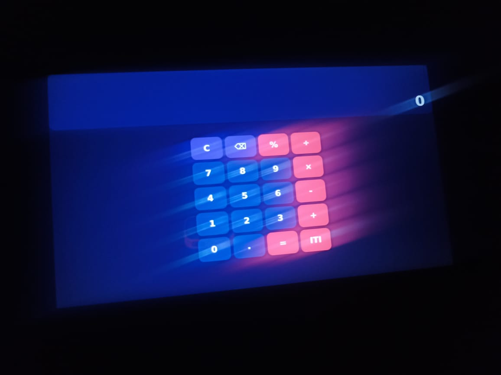

# 🍓 Yocto Custom Image for Raspberry Pi 3B+ with Qt6

> A hands-on Yocto project: build a custom Linux distro for the Raspberry Pi 3B+,
> wire it up to WiFi and Ethernet, harden SSH, install Qt6 with EGLFS graphics,
> and deploy a QML calculator app — all without reflashing the SD card every
> time you change a line of code.

**Target Board:** Raspberry Pi 3B+ (64-bit)
**Yocto Release:** Scarthgap (5.0)
**Qt Version:** Qt 6.8 (open source)
**Distro Name:** ITI_distro

---

## Output


## 📑 Table of Contents

1. [What This Project Is](#-what-this-project-is)
2. [The Stack](#-the-stack)
3. [Project Layout](#-project-layout)
4. [The Layers](#-the-layers)
5. [Distro Configuration](#-distro-configuration)
6. [Build Configuration](#-build-configuration)
7. [The Image Recipe](#-the-image-recipe)
8. [Networking](#-networking)
9. [SSH & Security](#-ssh--security)
10. [mDNS — Finding the RPi on the Network](#-mdns--finding-the-rpi-on-the-network)
11. [Qt6 Integration](#-qt6-integration)
12. [Deploying a Qt App with devtool](#-deploying-a-qt-app-with-devtool)
13. [Build & Flash](#-build--flash)
14. [Troubleshooting Diary](#-troubleshooting-diary)
15. [Lessons Learned](#-lessons-learned)
16. [What's Next](#-whats-next)

---

## 🎯 What This Project Is

This started as a learning project: build a real, useful Linux image for the
Raspberry Pi 3B+ from scratch using Yocto. By the end, the goal was to:

- Boot a custom distro with a non-root user
- Connect to WiFi automatically (and have Ethernet as a backup)
- SSH into it from a laptop using `raspberrypi3-64.local` (no IP hunting)
- Run a Qt6 QML application on the HDMI display
- Iterate on that app **without reflashing the SD card** every time

What you're reading is the documentation of that journey — including the bugs,
the dead ends, and the fixes. If you're learning Yocto, this should save you
a few hours of head-scratching.

---

## 🧱 The Stack

| Component | Choice | Why |
|---|---|---|
| **Build host** | Ubuntu (Lenovo laptop) | Standard Yocto workflow |
| **Target** | Raspberry Pi 3B+ (64-bit) | ARMv8, vc4 GPU for Qt EGLFS |
| **Yocto branch** | scarthgap | Long-term support release |
| **Init system** | systemd | Modern, networkd integration, socket activation |
| **Graphics** | Qt6 + EGLFS via DRM/KMS | No X11 — direct rendering on the GPU |
| **Network manager** | systemd-networkd + wpa_supplicant | Lightweight, no NetworkManager |
| **Service discovery** | avahi-daemon (mDNS) | `*.local` resolution |

---

## 📁 Project Layout

```
~/Embedded_Linux_env/buildSystems/yocto/
├── poky/                      # Yocto core (scarthgap)
├── meta-raspberrypi/          # RPi BSP (scarthgap)
├── meta-openembedded/         # meta-oe, meta-python, meta-networking (scarthgap)
├── meta-qt6/                  # Qt6 layer (branch 6.8)
│
├── meta-mylayer/              # 👈 Software policy (this is where "I" live)
│   ├── conf/
│   │   ├── layer.conf
│   │   └── distro/
│   │       └── ITI_distro.conf
│   ├── recipes-core/
│   │   └── images/
│   │       └── my-custom-image.bb
│   ├── recipes-connectivity/
│   │   └── openssh/
│   │       └── openssh_%.bbappend
│   ├── recipes-qt6/
│   │   ├── qt-env/
│   │   │   ├── qt-env.bb
│   │   │   └── files/
│   │   │       ├── qt-env.sh
│   │   │       └── LICENSE
│   │   └── qtbase/
│   │       └── qtbase_%.bbappend
│   └── recipes-apps/
│       └── qt-calculator/     # Graduated from devtool workspace
│           └── qt-calculator_git.bb
│
├── meta-rpi-3b-plus/          # 👈 Hardware-specific (board-level config)
│   └── recipes-connectivity/
│       ├── wifi-config/
│       └── eth-config/
│
├── build-rpi/                 # Build directory
│   ├── conf/
│   │   ├── local.conf
│   │   └── bblayers.conf
│   └── workspace/             # devtool's playground
│
└── shared/                    # DL_DIR, SSTATE_DIR, TMPDIR (shared across builds)
```

### Why two custom layers?

I split things into two layers on purpose:

- **`meta-mylayer`** = *software policy.* Distro definition, image recipe,
  application recipes, security tweaks. This is "what I want my system to do."
- **`meta-rpi-3b-plus`** = *hardware specifics.* WiFi config, Ethernet config,
  anything tied to this specific board. If I ever port to a different RPi,
  I'd swap this layer and keep `meta-mylayer` mostly intact.

It's the same separation of concerns you'd see in a real product team.

---


| Feature | Why |
|---|---|
| `systemd` | Modern init, socket activation, networkd |
| `usrmerge` | Merges `/bin` → `/usr/bin` (systemd best practice) |
| `wifi` | Compile-time WiFi support across recipes |
| `opengl` | Required for Qt6 EGLFS on the vc4 GPU |

---

## 🌐 Networking

Both interfaces use `systemd-networkd` with DHCP. This was a deliberate
choice — static IPs are fragile (the first time I tried, my static
192.168.1.x didn't match the actual subnet 10.x.x.x and the RPi was
unreachable on WiFi).

### WiFi (`meta-rpi-3b-plus/recipes-connectivity/wifi-config/`)

**`wifi-config.bb`** installs three files:

| File | Destination | Purpose |
|---|---|---|
| `wpa_supplicant-wlan0.conf` | `/etc/wpa_supplicant/` | SSID + PSK |
| `wlan0.network` | `/etc/systemd/network/` | DHCP config |
| `wifi-setup.service` | `/usr/lib/systemd/system/` | Starts wpa_supplicant |

### Ethernet (`meta-rpi-3b-plus/recipes-connectivity/eth-config/`)

`systemd-networkd` (already running) picks it up automatically. Acts as
a safety net: if WiFi fails, plug in a cable and you're back online.

---

## 🔐 SSH & Security

### Production policy: root SSH disabled

**File:** `meta-mylayer/recipes-connectivity/openssh/openssh_%.bbappend`


### Development override: root SSH enabled

For `devtool deploy-target` to work (it requires root over SSH), I
temporarily flipped the policy to `yes` during development. After the
app is finalized and baked into the image, switch it back to `no`.

### Socket activation

OpenSSH on this image uses systemd socket activation, not a permanently
running daemon:

```
sshd.socket           # listens on port 22
sshd@.service         # spawned per-connection
sshdgenkeys.service   # generates host keys on first boot
```

> ⚠️ Don't run `systemctl status sshd` — it'll show a SysV compat unit.
> Use `systemctl status sshd.socket` instead.

---

## 📡 mDNS — Finding the RPi on the Network

Adding `avahi-daemon` to the image lets me reach the board by hostname:

```bash
ssh abdelfattah@raspberrypi3-64.local
```

No more "what IP did the router give it this time?" — `avahi-daemon`
broadcasts the hostname over multicast DNS, and any modern OS (Linux
with `nss-mdns`, macOS Bonjour, Windows with Bonjour) resolves it.

I figured out the right package name by inspecting:

```bash
bitbake -e avahi | grep "^PACKAGES="
```

---

## 🎨 Qt6 Integration

### Layer + recipe additions

`meta-qt6` (branch 6.8) is added in `bblayers.conf`. The image installs:

```bash
qtbase qtdeclarative qtshadertools qtsvg qtimageformats qt-env
```

### qtbase needs EGLFS enabled

By default, `qtbase` doesn't include the EGLFS platform plugin. Without
it, you get this fun error:

```
qt.qpa.plugin: Could not find the Qt platform plugin "eglfs" in ""
Available platform plugins are: xcb, minimal, vnc, offscreen, ...
```

**Fix:** `meta-mylayer/recipes-qt6/qtbase/qtbase_%.bbappend`

```bitbake
PACKAGECONFIG:append:class-target = " eglfs kms gbm"
```

> ⚠️ The `:class-target` override is **critical**. Without it, the
> append also applies to `qtbase-native` (the build-host version),
> which fails because EGLFS/KMS/GBM make no sense on x86_64.

### qt-env recipe — environment for the user

**`meta-mylayer/recipes-qt6/qt-env/files/qt-env.sh`:**

```bash
export QT_QPA_PLATFORM=eglfs
```

This file lands in `/etc/profile.d/` and is sourced at every login.
No systemd service required — clean, simple, gets the job done.

### EGLFS gotchas

EGLFS isn't just "set the env var and go." It needs:

1. ✅ `qtbase` built with `eglfs kms gbm` PACKAGECONFIG
2. ✅ `opengl` in `DISTRO_FEATURES`
3. ✅ User in `video,render,input` groups (to access `/dev/dri/card0`)
4. ✅ `QT_QPA_PLATFORM=eglfs` exported
5. ✅ Fonts installed (otherwise: empty boxes instead of text)

Skip any of these and you'll spend an hour debugging.

---

## 🚀 Deploying a Qt App with devtool

The slowest possible workflow is: edit code → rebuild image → flash SD →
boot → test → repeat. That's 20+ minutes per iteration.

`devtool` cuts this down to seconds.

### The workflow

```
devtool add <name> <git-url>      # create recipe + fetch source
   ↓
edit recipe / source as needed
   ↓
devtool build <name>              # build just this recipe
   ↓
devtool deploy-target <name> root@host   # rsync to live RPi
   ↓
ssh in, run, see what breaks
   ↓
fix, devtool build, devtool deploy-target — repeat in seconds
   ↓
devtool finish <name> meta-mylayer       # graduate to real layer
```

### Step 1 — Prepare the GitHub repo

Yocto fetchers clone whole repos — they don't fetch subdirectories of a
monorepo. So the calculator app got its own repo:

**`https://github.com/Abdelfattah225/qt-calculator`**

```
qt-calculator/
├── LICENSE          ← required (MIT)
├── CMakeLists.txt
├── main.cpp
├── Main.qml
└── CalcButton.qml
```

### Step 2 — `devtool add`

```bash
cd build-rpi
source ../poky/oe-init-build-env .

devtool add qt-calculator \
  "git://github.com/Abdelfattah225/qt-calculator.git;protocol=https;branch=main"
```

> ⚠️ Use **single quotes** — without them, bash eats the `;` characters.

This creates `workspace/recipes/qt-calculator/qt-calculator_git.bb` and
checks out the source into `workspace/sources/qt-calculator/`.

### Step 3 — Edit the auto-generated recipe

devtool's guess is a starting point, not a finished recipe. Final version:

**Key choices:**

- **`inherit qt6-cmake`** (not `cmake`) — provided by meta-qt6, sets up
  Qt6 cross-sysroot paths. (Note: the file is `qt6-cmake.bbclass`, not
  `cmake_qt6` — I got that wrong on the first try.)
- **`DEPENDS`** = build-time. Includes `-native` versions of tools that
  run on the build host (`qmltyperegistrar`, `qmlcachegen`, shader tools).
- **`RDEPENDS:${PN}`** = runtime. Shared libraries the binary needs on
  the RPi.

### Step 4 — Build, deploy, run

```bash
# Build (only this recipe, fast)
devtool build qt-calculator

# Push binary + QML modules to the live RPi
devtool deploy-target qt-calculator root@raspberrypi3-64.local

# Run on the RPi
ssh abdelfattah@raspberrypi3-64.local
source /etc/profile.d/qt-env.sh
appTask02_Basic_Calculator
```

The calculator pops up on HDMI. 🎉

### Step 5 — Graduate the recipe (optional)

When the recipe is solid:

```bash
devtool finish qt-calculator meta-mylayer
```

This moves the recipe out of `workspace/` and into
`meta-mylayer/recipes-apps/qt-calculator/`. Add it to the image:

```bitbake
IMAGE_INSTALL:append = " qt-calculator"
```

Now it's baked into every future build of the image.

---

## 🔧 Build & Flash

```bash
# Source the build environment
cd ~/Embedded_Linux_env/buildSystems/yocto
source poky/oe-init-build-env build-rpi

# Sanity check — parse without building
bitbake my-custom-image -p

# Full build
bitbake my-custom-image
```

The image lands at:
```
build-rpi/tmp/deploy/images/raspberrypi3-64/my-custom-image-raspberrypi3-64.rootfs.wic.bz2
```

### Flash

```bash
# Faster (skips empty blocks)
sudo bmaptool copy \
    my-custom-image-raspberrypi3-64.rootfs.wic.bz2 /dev/sdX

# Classic dd
bzcat my-custom-image-raspberrypi3-64.rootfs.wic.bz2 \
    | sudo dd of=/dev/sdX bs=4M status=progress
sync
```

### Serial console for debugging

```bash
sudo screen /dev/ttyUSB0 115200
```

---

## 💡 Lessons Learned

1. **Two layers > one layer.** Splitting hardware-specific stuff
   (`meta-rpi-3b-plus`) from software policy (`meta-mylayer`) made the
   project way easier to reason about.

2. **`devtool` is for *source* iteration, not *config* changes.** When
   you need to flip a `PACKAGECONFIG` or add fonts, use a `bbappend`
   in your real layer. devtool is the wrong tool for that.

3. **Auto-generated recipes are a starting point.** Always read the
   warnings (`# NOTE: unable to map ...`) — they tell you exactly what
   you'll need to fix manually.

4. **Build-time vs runtime dependencies are different things.**
   `DEPENDS` populates the cross-sysroot for compilation. `RDEPENDS`
   ensures the runtime libs are in the final image. Get them mixed up
   and you'll either fail to build or fail to run.

5. **`-native` recipes are built for your laptop, not the RPi.** Tools
   like `qmlcachegen` and `moc` execute on the host during the build.

6. **Override syntax matters.** `:class-target` and `:class-native`
   prevent appends from leaking into variants where they don't belong.

7. **EGLFS is a five-part contract.** PACKAGECONFIG + DISTRO_FEATURES +
   group membership + env var + fonts. Miss one, miss them all.

8. **Always quote git URLs with `;` in them.** Bash will eat the
   `;branch=main` part otherwise — silently — and you'll wonder why
   you got the wrong branch.

9. **Static IPs are a trap for portable images.** Use DHCP unless you
   have a very specific reason.

10. **UART is your best friend.** Serial console saved me when SSH
    wasn't working, when networking was broken, when systemd refused
    to start a service. Always wire it up.
