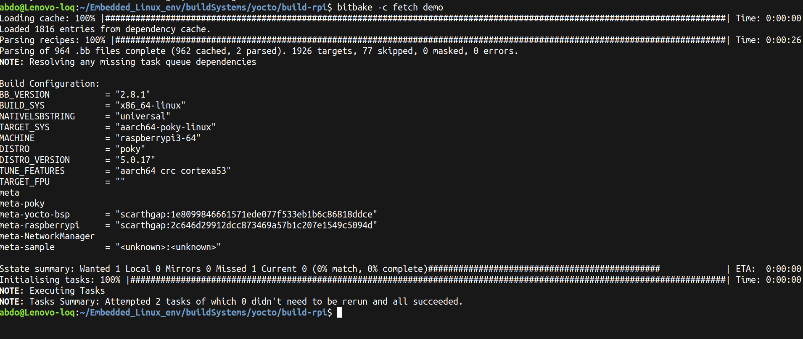
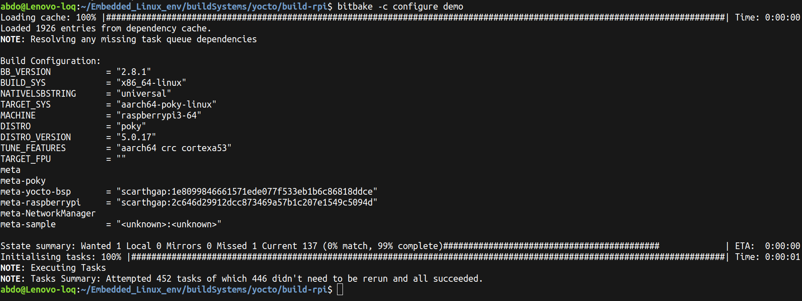
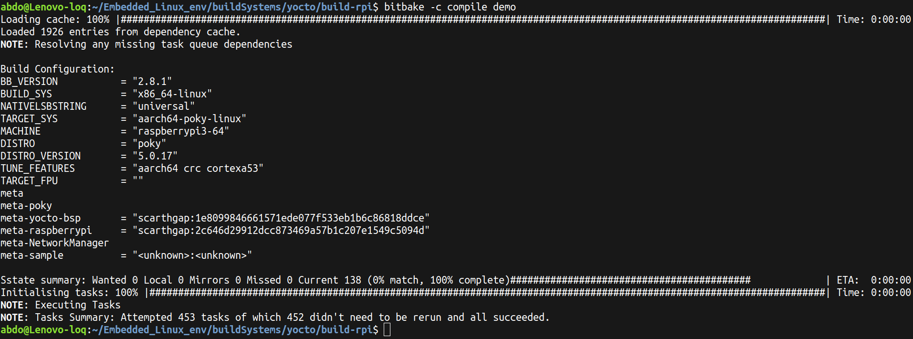
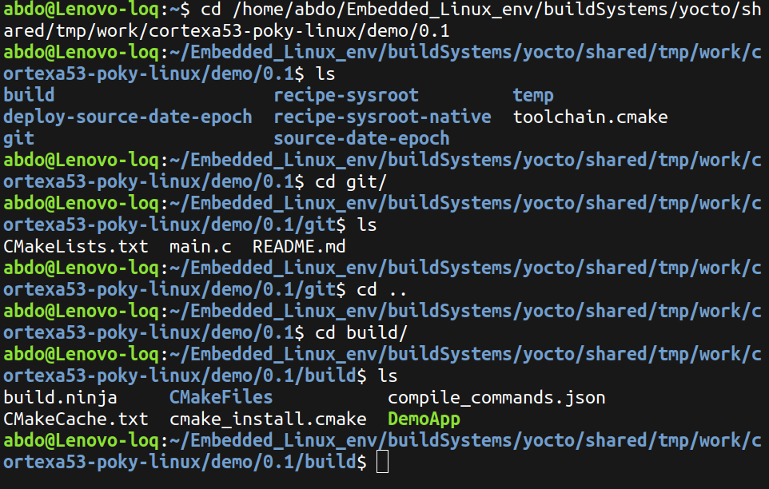

# Yocto Project - Demo App Recipe

A simple "Hello World" application built using the **Yocto Project** build system. This project demonstrates how to create a custom Yocto layer (`meta-sample`) with a recipe that fetches source code from GitHub, configures it with **CMake**, and cross-compiles it for a target platform.

---

## 📁 Project Structure

```
meta-sample/
├── conf/
│   └── layer.conf
└── recipes-apps/
    └── demoApp/
        └── demo_0.1.bb
```

### GitHub Source Repository

```
Demo-App/
├── CMakeLists.txt
├── main.c
└── README.md
```

---

## 📝 Recipe Overview

The recipe `demo_0.1.bb` performs the following tasks:

| Step | Description |
|------|-------------|
| **Fetch** | Clones the source code from GitHub |
| **Configure** | Runs CMake to generate build files |
| **Compile** | Cross-compiles the application for the target architecture |
| **Install** | Installs the binary to the target rootfs |

---

## 🔧 Build Instructions

### 1. Add the Layer

```bash
bitbake-layers add-layer ../meta-sample
```

### 2. Fetch the Source Code

```bash
bitbake -c fetch demo
```



### 3. Configure (CMake)

```bash
bitbake -c configure demo
```



### 4. Compile

```bash
bitbake -c compile demo
```




## 📂 Build Output

After a successful build, the output files can be found at:

```
tmp/work/cortexa53-poky-linux/demo/0.1/
├── git/              ← Fetched source code (main.c, CMakeLists.txt)
├── build/            ← CMake build output (DemoApp binary)
│   ├── build.ninja
│   ├── CMakeFiles/
│   ├── CMakeCache.txt
│   ├── cmake_install.cmake
│   ├── compile_commands.json
│   └── DemoApp
├── image/            ← Installed binary
└── temp/             ← Build logs
```



---

## 🛠 Tools & Environment

- **Yocto Project** (Poky)
- **BitBake** build engine
- **CMake** build system
- **Target Architecture**: `cortexa53` (ARM)

---

## 👤 Author

**Abdelfattah** 
