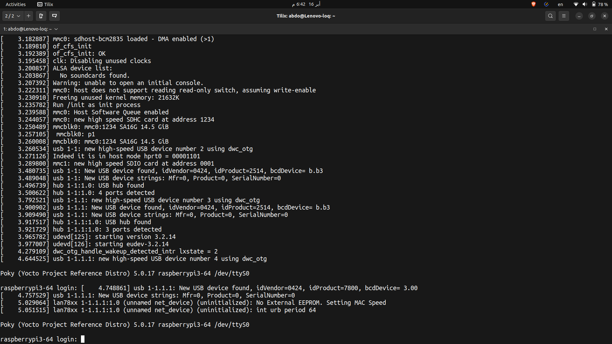
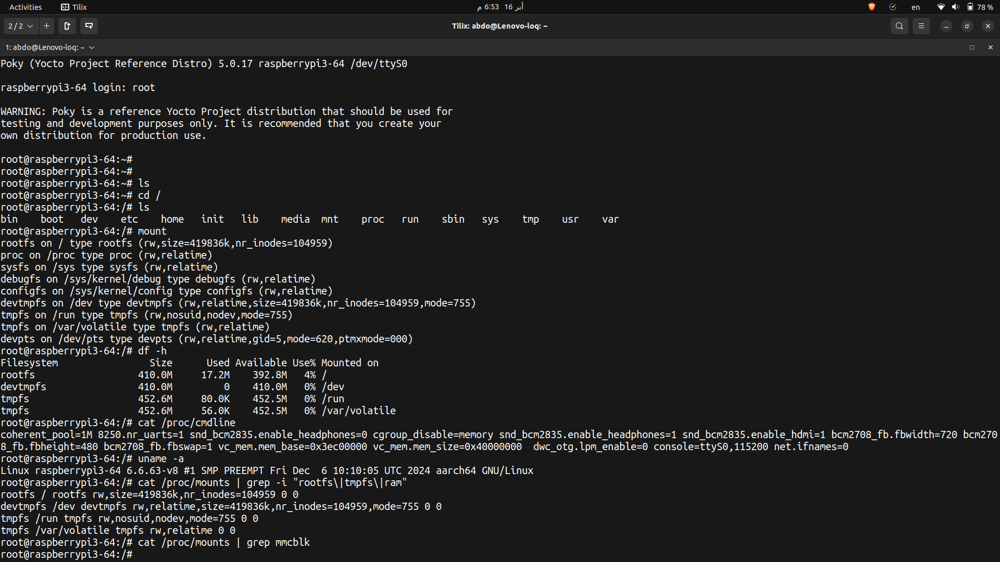

# Yocto + Raspberry Pi 3 (64-bit): Boot from initramfs (RAM)

## 📋 Overview

This guide documents deploying a Yocto-built `core-image-minimal` image
on a Raspberry Pi 3 (64-bit) that runs **entirely from RAM** using 
initramfs, instead of the traditional SD card rootfs partition.

## 🏗️ Architecture

### Before (Traditional SD Card Boot)
```
SD Card
├── Partition 1 (FAT32 - boot)
│   ├── kernel Image
│   ├── Device Trees
│   └── RPi firmware files
└── Partition 2 (ext4 - rootfs)
    └── / (root filesystem)
```

### After (initramfs RAM Boot)
```
SD Card (ONE partition only)
└── Partition 1 (FAT32 - boot)
    ├── kernel8.img (kernel + rootfs BUNDLED)
    ├── Device Trees
    ├── RPi firmware files
    └── cmdline.txt (no root= parameter)

RAM
└── / (root filesystem - 410MB, 17.2MB used)
```

## 🛠️ Environment

| Component | Version/Details |
|-----------|----------------|
| **Yocto Release** | Scarthgap (5.0.17) |
| **BitBake** | 2.8.1 |
| **Machine** | raspberrypi3-64 |
| **Kernel** | Linux 6.6.63-v8 aarch64 |
| **Layer: meta-raspberrypi** | scarthgap branch |
| **Host OS** | Ubuntu (x86_64) |
| **Target** | Raspberry Pi 3 Model B/B+ |

## 📂 Yocto Layers Used

```
layer                 priority
===========================================
core (meta)           5
meta-poky             5
meta-yocto-bsp        5
meta-raspberrypi      9
meta-NetworkManager   6
meta-sample           6
meta-dash             6
```

## 🔧 Step-by-Step Guide

### Step 1: Research meta-raspberrypi Documentation

Before making changes, read the official documentation:

```bash
cd meta-raspberrypi
cat docs/extra-build-config.md    # Section: "Image with Initramfs"
cat recipes-bsp/bootfiles/rpi-cmdline.bb  # Understand cmdline.txt generation
```

**Key findings:**
- `rpi-cmdline.bb` generates `cmdline.txt` with `root=/dev/mmcblk0p2` by default
- `CMDLINE_ROOTFS` variable uses `?=` (weak assignment), can be overridden
- meta-raspberrypi docs recommend specific variables for initramfs


### Step 2: Configure `local.conf`

Add the following lines to `conf/local.conf`:

```bash
# ============================================
# INITRAMFS CONFIGURATION
# ============================================
INITRAMFS_IMAGE = "core-image-minimal"
INITRAMFS_IMAGE_BUNDLE = "1"
BOOT_SPACE = "1073741"
INITRAMFS_MAXSIZE = "315400"
IMAGE_FSTYPES:pn-${INITRAMFS_IMAGE} = "${INITRAMFS_FSTYPES}"

# Remove root= from cmdline.txt so kernel uses initramfs as rootfs
CMDLINE_ROOTFS = ""
```

**Important notes:**
- `INITRAMFS_IMAGE = "core-image-minimal"` — uses the FULL image, not `core-image-minimal-initramfs`
- `INITRAMFS_IMAGE_BUNDLE = "1"` — embeds rootfs inside kernel binary
- `CMDLINE_ROOTFS = ""` — removes `root=/dev/mmcblk0p2` from cmdline.txt
  - This works because `rpi-cmdline.bb` uses `?=` (weak assignment)
  - Our `=` (strong assignment) overrides it


### Step 3: Build the Image

```bash
cd ~/Embedded_Linux_env/buildSystems/yocto/
source poky/oe-init-build-env build-rpi

bitbake core-image-minimal
```

### Step 4: Verify Build Artifacts

```bash
ls -lh tmp/deploy/images/raspberrypi3-64/ | grep Image
```

Expected output:
```
Image                        = 27MB   (kernel only)
Image-initramfs              = 43MB   (kernel + rootfs bundled)
```

Verify cmdline.txt has no root= parameter:
```bash
cat tmp/deploy/images/raspberrypi3-64/bootfiles/cmdline.txt
# Expected: dwc_otg.lpm_enable=0  net.ifnames=0
```

> **Screenshot: Build artifacts showing Image-initramfs**

### Step 5: Prepare SD Card

Create ONE FAT32 partition:

```bash
sudo fdisk /dev/sdX    # Replace X with your SD card device
# d → delete all partitions
# n → new partition (use all space)
# t → change type to 'c' (W95 FAT32 LBA)
# w → write

sudo mkfs.vfat -F 32 -n BOOT /dev/sdX1
```

### Step 6: Copy Boot Files to SD Card

```bash
sudo mount /dev/sdX1 /mnt
DEPLOY=~/Embedded_Linux_env/buildSystems/yocto/shared/tmp/deploy/images/raspberrypi3-64

# Bundled kernel (kernel + initramfs)
sudo cp $DEPLOY/Image-initramfs-raspberrypi3-64.bin /mnt/kernel8.img

# Device trees
sudo cp $DEPLOY/bcm2710-rpi-3-b.dtb /mnt/
sudo cp $DEPLOY/bcm2710-rpi-3-b-plus.dtb /mnt/

# RPi firmware
sudo cp $DEPLOY/bootfiles/bootcode.bin /mnt/
sudo cp $DEPLOY/bootfiles/start.elf /mnt/
sudo cp $DEPLOY/bootfiles/fixup.dat /mnt/
sudo cp $DEPLOY/bootfiles/config.txt /mnt/
sudo cp $DEPLOY/bootfiles/cmdline.txt /mnt/

# Overlays
sudo mkdir -p /mnt/overlays
sudo cp $DEPLOY/bootfiles/overlays/* /mnt/overlays/ 2>/dev/null

# Add UART support for serial console
echo "enable_uart=1" | sudo tee -a /mnt/config.txt
echo "dwc_otg.lpm_enable=0 console=serial0,115200 net.ifnames=0" | sudo tee /mnt/cmdline.txt

sync
sudo umount /mnt
```

### Step 7: Boot and Verify

Insert SD card into RPi3, connect serial console, power on.

> **Screenshot: Boot log showing "Run /init as init process"**

> **Screenshot: Login prompt "raspberrypi3-64 login:"**



### Step 8: Verify Running from RAM

```bash
mount                              # rootfs on / type rootfs
df -h                              # rootfs 410MB, 17.2MB used
cat /proc/cmdline                  # no root= parameter
cat /proc/mounts | grep mmcblk    # EMPTY - no SD card rootfs
```

> **Screenshot: Verification commands showing RAM rootfs**



## ⚠️ Troubleshooting

### Issue 1: "Cannot find rootfs.img" Error
**Cause:** Using `core-image-minimal-initramfs` instead of `core-image-minimal`
**Fix:** Change `INITRAMFS_IMAGE = "core-image-minimal"` in local.conf

### Issue 2: No Serial Output
**Cause:** UART not enabled
**Fix:** Add `enable_uart=1` to config.txt and `console=serial0,115200` to cmdline.txt

### Issue 3: "Could not find cpio.gz for bundling" Error
**Cause:** Naming mismatch between `.rootfs.cpio.gz` and expected `.cpio.gz`
**Fix:** Create symlink:
```bash
cd tmp/deploy/images/raspberrypi3-64/
ln -sf core-image-minimal-raspberrypi3-64.rootfs.cpio.gz \
       core-image-minimal-raspberrypi3-64.cpio.gz
```

## 🔑 Key Concepts Learned

### Why `CMDLINE_ROOTFS = ""` Works
```
In rpi-cmdline.bb:
  CMDLINE_ROOTFS ?= "root=/dev/mmcblk0p2 rootfstype=ext4 rootwait"
                 ^^
                 ?= means weak assignment (default value)

In our local.conf:
  CMDLINE_ROOTFS = ""
                ^^
                = means strong assignment (overrides weak)
```

### initramfs vs Traditional Boot
| Feature | SD Card rootfs | initramfs (RAM) |
|---------|---------------|-----------------|
| Speed | Slow (I/O) | ⚡ Very fast |
| Wear | SD card degrades | No wear |
| Persistence | Data survives reboot | Lost on reboot |
| Size | SD card size | Limited by RAM |
| Partitions | 2 (boot + rootfs) | 1 (boot only) |

### core-image-minimal-initramfs vs core-image-minimal
| | core-image-minimal-initramfs | core-image-minimal |
|---|---|---|
| Purpose | Temporary loader | Full standalone OS |
| Behavior | Searches for rootfs.img, switches root | Stays in RAM permanently |
| Use case | Stage 1 boot → switch to real rootfs | Final rootfs in RAM |


## 📁 Files Modified

| File | Change | Purpose |
|------|--------|---------|
| `conf/local.conf` | Added initramfs variables | Enable initramfs build |
| `conf/local.conf` | Added `CMDLINE_ROOTFS = ""` | Remove root= from cmdline |
| `config.txt` (on SD) | Added `enable_uart=1` | Enable serial console |
| `cmdline.txt` (on SD) | Added `console=serial0,115200` | Serial console output |
